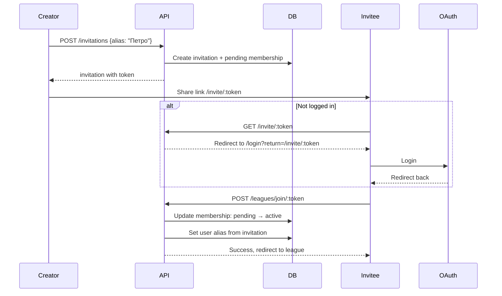

# Розширена система інвайтів з placeholder-гравцями

## Огляд

Додати можливість створювати "placeholder" гравців при створенні інвайту, продовжувати термін дії інвайтів, та покращити flow прийняття інвайтів для незалогінених користувачів.

## Нові можливості

1. **Alias при створенні інвайту** - творець інвайту вказує аліас майбутнього гравця
2. **Placeholder-член ліги** - відображається в списку учасників як "очікує приєднання"
3. **Продовження інвайту** - додати ще 7 днів до заекспайреного інвайту
4. **Заборона self-use** - творець не може використати власний інвайт
5. **Login flow для інвайтів** - незалогінений користувач → логін → автоматичне приєднання

## Зміни в моделях

### Backend: LeagueInvitation

```go
type LeagueInvitation struct {
    // ... existing fields ...
    PlayerAlias string  // NEW: аліас гравця
}
```

### Backend: LeagueMembership

```go
type MembershipStatus = "active" | "banned" | "pending"  // ADD: pending
```

Pending membership = placeholder, очікує прийняття інвайту

## API зміни

### Backend

1. **POST /api/leagues/:code/invitations** - додати поле `alias` в request
2. **POST /api/leagues/:code/invitations/:token/extend** - NEW: продовжити інвайт на 7 днів
3. **POST /api/leagues/join/:token** - оновити:

   - Перевірка що `createdBy != currentUser`
   - Оновити pending membership → active
   - Встановити alias з інвайту

### Frontend

1. **InvitationDetailsDialog** - додати поле для alias при створенні
2. **LeagueInvitation** - показувати alias в списку інвайтів, кнопка "Продовжити"
3. **AcceptInvitation** - якщо не залогінений → redirect на login з return URL
4. **Members list** - показувати pending членів як "очікує приєднання"

## Flow діаграма



## Список учасників з pending

| Гравець | Статус |

|---------|--------|

| Андрій  | Активний |

| Петро   | Очікує приєднання |

| Марія   | Активний |

## Файли для зміни

### Backend

- [`backend/models/league_invitation.go`](backend/models/league_invitation.go) - додати PlayerAlias
- [`backend/models/league_membership.go`](backend/models/league_membership.go) - додати pending status
- [`backend/services/league_service.go`](backend/services/league_service.go) - логіка створення/прийняття
- [`backend/gameapi/league.go`](backend/gameapi/league.go) - API handlers
- [`backend/repositories/league_invitation_repository.go`](backend/repositories/league_invitation_repository.go) - extend method

### Frontend

- [`frontend/src/api/LeagueApi.ts`](frontend/src/api/LeagueApi.ts) - API types
- [`frontend/src/components/league/InvitationDetailsDialog.vue`](frontend/src/components/league/InvitationDetailsDialog.vue) - alias input
- [`frontend/src/components/league/LeagueInvitation.vue`](frontend/src/components/league/LeagueInvitation.vue) - extend button
- [`frontend/src/views/LeagueDetails.vue`](frontend/src/views/LeagueDetails.vue) - pending members display
- [`frontend/src/views/AcceptInvitation.vue`](frontend/src/views/AcceptInvitation.vue) - login redirect flow
- [`frontend/src/i18n/index.ts`](frontend/src/i18n/index.ts) - translations

## Рішення

- **Аліас вводиться в діалозі створення інвайту** (InvitationDetailsDialog)
- **Аліас pending-члена можна редагувати** до прийняття інвайту

## Тести

- Unit tests для `CreateInvitation` з alias та pending membership
- Unit tests для `AcceptInvitation` з self-use перевіркою та alias assignment
- Unit tests для `ExtendInvitation`
- Unit tests для редагування alias pending-члена

## Документація

- Оновити README з описом нової функціональності інвайтів
- Додати приклади API запитів для нових endpoints