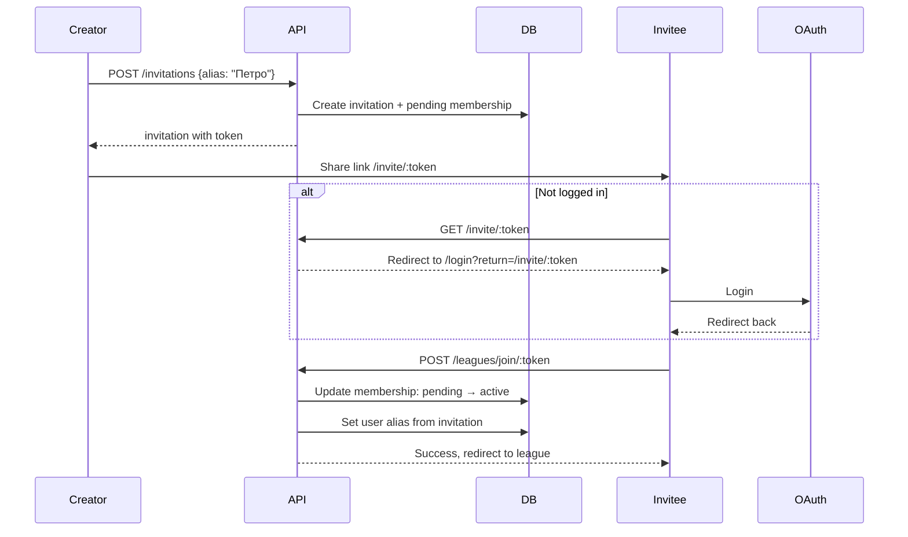

# Розширена система інвайтів з placeholder-гравцями

## Огляд

Додати можливість створювати "placeholder" гравців при створенні інвайту, продовжувати термін дії інвайтів, та покращити flow прийняття інвайтів для незалогінених користувачів.

## Нові можливості

1. **Alias при створенні інвайту** - творець інвайту вказує аліас майбутнього гравця
2. **Placeholder-член ліги** - відображається в списку учасників як "очікує приєднання"
3. **Pending-члени можуть грати** - запрошені гравці можуть брати участь в іграх та обліковуватись в рейтингу
4. **Продовження інвайту** - додати ще 7 днів до заекспайреного інвайту
5. **Заборона self-use** - творець не може використати власний інвайт
6. **Login flow для інвайтів** - незалогінений користувач → логін → автоматичне приєднання

## Зміни в моделях

### Backend: LeagueInvitation

```go
type LeagueInvitation struct {
    // ... existing fields ...
    PlayerAlias string  // NEW: аліас гравця
}
```

### Backend: LeagueMembership

```go
type MembershipStatus = "active" | "banned" | "pending"  // ADD: pending

type LeagueMembership struct {
    // ... existing fields ...
    Alias string  // NEW: аліас гравця (копіюється з інвайту)
}
```

Pending membership = placeholder, очікує прийняття інвайту

### Backend: GameRound (BREAKING CHANGE)

```go
type GameRoundPlayer struct {
    MembershipID primitive.ObjectID  // CHANGE: замість PlayerID (user_id)
    // ... rest of fields ...
}
```

**Примітка:** Міграція існуючих даних не потрібна на даному етапі

### Backend: Standings

Розрахунок standings тепер по `membership_id`, а не по `user_id`. Це дозволяє pending-членам мати статистику.

## API зміни

### Backend

1. **POST /api/leagues/:code/invitations** - додати поле `alias` в request
2. **POST /api/leagues/:code/invitations/:token/extend** - NEW: продовжити інвайт на 7 днів
3. **POST /api/leagues/join/:token** - оновити:

   - Перевірка що `createdBy != currentUser`
   - Оновити pending membership → active
   - Встановити alias з інвайту

### Frontend

1. **InvitationDetailsDialog** - додати поле для alias при створенні
2. **LeagueInvitation** - показувати alias в списку інвайтів, кнопка "Продовжити"
3. **AcceptInvitation** - якщо не залогінений → redirect на login з return URL
4. **Members list** - показувати pending членів як "очікує приєднання"

## Flow діаграма



## Список учасників з pending

| Гравець | Статус |

|---------|--------|

| Андрій  | Активний |

| Петро   | Очікує приєднання |

| Марія   | Активний |

## Файли для зміни

### Backend

- [`backend/models/league_invitation.go`](backend/models/league_invitation.go) - додати PlayerAlias
- [`backend/models/league_membership.go`](backend/models/league_membership.go) - додати pending status
- [`backend/services/league_service.go`](backend/services/league_service.go) - логіка створення/прийняття
- [`backend/gameapi/league.go`](backend/gameapi/league.go) - API handlers
- [`backend/repositories/league_invitation_repository.go`](backend/repositories/league_invitation_repository.go) - extend method

### Frontend

- [`frontend/src/api/LeagueApi.ts`](frontend/src/api/LeagueApi.ts) - API types
- [`frontend/src/components/league/InvitationDetailsDialog.vue`](frontend/src/components/league/InvitationDetailsDialog.vue) - alias input
- [`frontend/src/components/league/LeagueInvitation.vue`](frontend/src/components/league/LeagueInvitation.vue) - extend button
- [`frontend/src/views/LeagueDetails.vue`](frontend/src/views/LeagueDetails.vue) - pending members display
- [`frontend/src/views/AcceptInvitation.vue`](frontend/src/views/AcceptInvitation.vue) - login redirect flow
- [`frontend/src/i18n/index.ts`](frontend/src/i18n/index.ts) - translations

## Рішення

- **Аліас вводиться в діалозі створення інвайту** (InvitationDetailsDialog)
- **Аліас pending-члена можна редагувати** до прийняття інвайту
- **Pending-члени можуть грати в ігри** та обліковуватись в рейтинговій таблиці ліги

## Тести

- Unit tests для `CreateInvitation` з alias та pending membership
- Unit tests для `AcceptInvitation` з self-use перевіркою та alias assignment
- Unit tests для `ExtendInvitation`
- Unit tests для редагування alias pending-члена

## Документація

- Оновити README з описом нової функціональності інвайтів
- Додати приклади API запитів для нових endpoints

---

## Статус імплементації (13.01.2026)

### ✅ Реалізовано

**Backend:**
- `LeagueInvitation` model: додано `PlayerAlias`, `MembershipID`
- `LeagueMembership` model: додано статус `pending`, поле `Alias`, `InvitationID`
- `GameRoundPlayer` model: додано `MembershipID` (PlayerID залишено для зворотної сумісності)
- `CreateInvitation`: створює pending membership разом з інвайтом
- `AcceptInvitation`: перевірка self-use, активація pending → active
- `ExtendInvitation`: продовження інвайту на 7 днів
- `UpdatePendingMemberAlias`: редагування alias pending-члена
- `GetLeagueMemberships`: повертає всіх членів включно з pending
- Standings calculation: включає pending-членів, підтримує MembershipID та PlayerID

**Frontend:**
- Створення інвайту з alias (діалог)
- Список активних та expired інвайтів
- Кнопка "Продовжити" для expired інвайтів
- Деталі інвайту з QR-кодом та можливістю редагування alias
- Pending-члени в списку учасників з відповідним статусом
- Login redirect flow для незалогінених користувачів

**API Endpoints:**
```
POST /api/leagues/:code/invitations           - Create invitation (alias required)
GET  /api/leagues/:code/invitations           - List active invitations
GET  /api/leagues/:code/invitations/expired   - List expired invitations
POST /api/leagues/:code/invitations/:token/cancel  - Cancel invitation
POST /api/leagues/:code/invitations/:token/extend  - Extend invitation by 7 days
PUT  /api/leagues/:code/members/:memberCode/alias  - Update pending member alias
```

### 📝 Примітки

- Міграція даних для `GameRoundPlayer.MembershipID` не потрібна - старі записи продовжують працювати через `PlayerID`
- Для повноцінної підтримки pending-членів у виборі гравців для ігор потрібен league-aware game creation UI